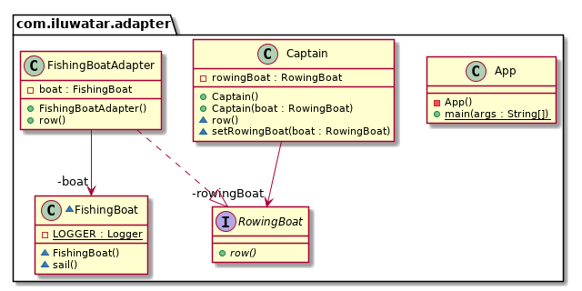

# adapter Pattern
适配器模式

Adapter适配器模式，将一个类的接口转换成客户希望的另外一个接口。使原本由于接口不兼容而不能一起工作的那些类可以一起工作了。

适配器模式有“类适配器”和“对象适配器”两种不同的形式。

1、优点

可以让任何两个没有关联的类一起运行；
增加了类的透明性；
提高了类的复用度；
灵活性非常好；

2、缺点

过多使用适配器会使系统非常凌乱；

由于java是单继承的，所以只能适配一个适配器类，而且目标类必须是抽象的；

只有碰到无法改变原有设计和代码的情况下，才会考虑适配器模式；

四、适配器模式的使用场景

1、系统需要使用现有的类，从而类的接口不符合系统的需要。

2、想建立一个可以重复使用的类，用于一些彼此之间没有太大关联的一些类。

3、通过接口转换，将一个类插入另一个类中。
