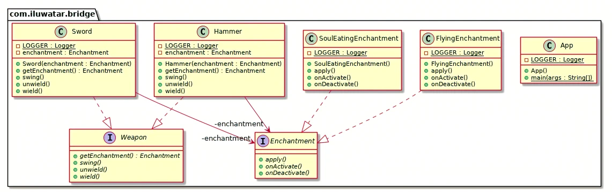

# bridge Pattern
桥接模式

桥接模式基于类的最小设计原则，通过使用封装、聚合、继承等行为让不同的类承担不同的职责。

它的主要特点是把抽象与行为实现分离开，从而可以保持各部分的独立性以及功能扩展。

1、优点

（1）实现了抽象和实现部分的分离

桥接模式分离了抽象部分和实现部分，从而极大的提供了系统的灵活性，让抽象部分和实现部分独立开来，分别定义接口，这有助于系统进行分层设计，从而产生更好的结构化系统。对于系统的高层部分，只需要知道抽象部分和实现部分的接口就可以了。

（2）更好的可扩展性

由于桥接模式把抽象部分和实现部分分离了，从而分别定义接口，这就使得抽象部分和实现部分可以分别独立扩展，而不会相互影响，大大的提供了系统的可扩展性。

（3）可动态的切换实现

由于桥接模式实现了抽象和实现的分离，所以在实现桥接模式时，就可以实现动态的选择和使用具体的实现。

（4）实现细节对客户端透明，可以对用户隐藏实现细节。

2、缺点

（1）桥接模式的引入增加了系统的理解和设计难度，由于聚合关联关系建立在抽象层，要求开发者针对抽象进行设计和编程。

（2）桥接模式要求正确识别出系统中两个独立变化的维度，因此其使用范围有一定的局限性。
