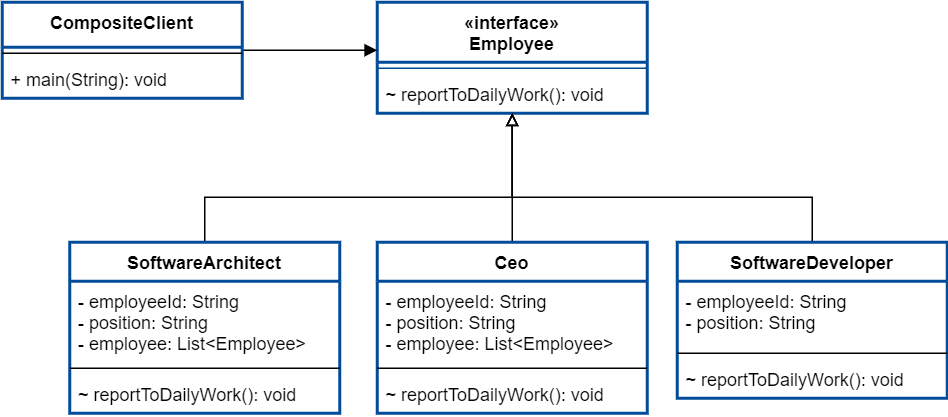

# Composite Pattern
组合模式

将对象组合成树形结构以表示“部分-整体”的层次结构。

#### 1、优点

（1）组合模式可以清晰的定义分层次的复杂对象，表示对象的全部或部分层次，它让客户端忽略了层次的差异，方便对整个层次结构进行控制。

（2）客户端可以一致地使用一个组合结构或其中单个对象，不必关心处理的是单个对象还是整个组合结构，简化了客户端代码。

（3）在组合模式中增加新的容器构件和叶子构件都很方便，无须对现有类库进行任何修改，符合“开闭原则”。

（4）组合模式为树形结构的面向对象实现提供了一种灵活的解决方案，通过叶子对象和容器对象的递归组合，可以形成复杂的树形结构，但对树形结构的控制却非常简单。

#### 2、缺点

（1）使得设计更加复杂，客户端需要花更多时间理清类之间的层次关系。

（2）在增加新构件时很难对容器中的构件类型进行限制。

#### 组合模式的使用场景

1、在具有整体和部分的层次结构中，希望通过一种方式忽略整体与部分的差异，客户端可以一致地对待它们。

2、在一个使用面向对象语言开发的系统中需要处理一个树形结构。

3、在一个系统中能够分离出叶子对象和容器对象，而且它们的类型不固定，需要增加一些新的类型。
————————————————
版权声明：本文为CSDN博主「哪 吒」的原创文章，遵循CC 4.0 BY-SA版权协议，转载请附上原文出处链接及本声明。
原文链接：https://blog.csdn.net/guorui_java/article/details/106617887