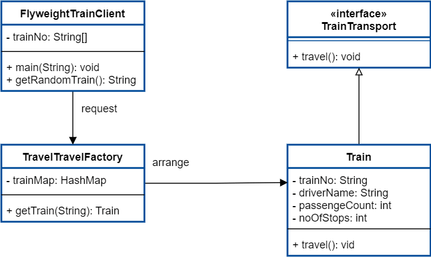

# Fly Weight Pattern
享元模式

说到享元模式，第一个想到的应该就是池技术了，String常量池、数据库连接池、缓冲池等等都是享元模式的应用，所以说享元模式是池技术的重要实现方式。

静态代理

## 享元模式的使用场景

1、何时应用

（1）系统中有大量对象时

（2）这些对象消耗大量内存时

（3）这些对象的状态大部分可以外部化时

（4） 需要缓冲池的场景

2、实现方式

用唯一标识码判断，如果在内存中有，则返回这个唯一标识码所标识的对象，用hashmap存储。

3、应用实例

（1）string常量池

（2）数据库连接池

## 享元模式和单例模式的区别

1、享元模式可以再次创建对象，也可以取缓存对象；单例模式则是严格控制单个进程中只有一个实例对象。

2、享元模式可以通过自己控制对外部的单例，也可以在需要时创建更多的对象；单例模式是自身控制，需要增加不属于该对象本身的逻辑。

两者都可以实现节省对象创建的时间， threadPool线程池、数据库连接池都有使用享元模式。