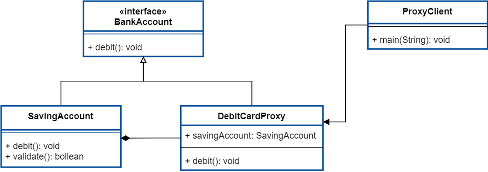

# Proxy Design Pattern
代理模式 

为其它对象提供一个代理以便控制这个对象的访问。

静态代理

JDK动态代理

jdk实现动态代理必须有实现接口InvocationHandler的处理类，用于执行被代理类的方法。

CGLib代理

CGLib采用了非常底层的字节码技术，其原理是通过字节码技术为一个类创建子类，并在子类中采用方法拦截的技术拦截所有父类方法的调用，顺势织入横切逻辑。但因为采用的是继承，所以不能对final修饰的类进行代理。JDK动态代理与CGLib动态代理均是实现Spring AOP的基础。